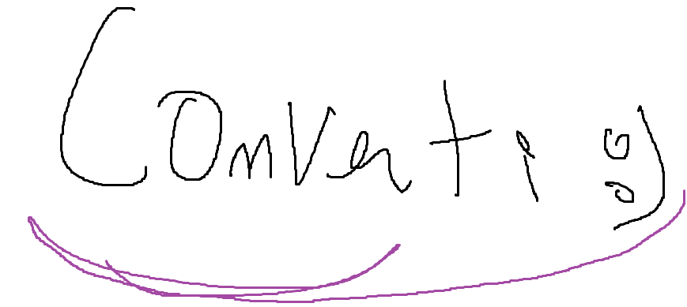

  

Converti is a fast, privacy focused file conversion tool designed to work **entirely offline** no ads, no slow servers, and no data tracking.

---

## 🌟 Features

- 100% local file conversion
- No cloud uploads and data collection
- Ad-free and subscription-free
- High-performance processing using modern libraries
- Support for a wide variety of file formats
- Sleek, responsive interface

---

## 🗂 Project Structure

- **Desktop App** — This is where the code for the desktop application can be found
- **Website** — The code for the converti website

---

## 🛠 Technologies Used

Converti uses a mix of modern web technologies and high-performance processing libraries to deliver fast, offline, and private file conversions.

- **[React](https://react.dev/)** — Modern UI library for building interactive user interfaces
- **[shadcn/ui](https://ui.shadcn.com/)** — Pre-built, accessible React UI components
- **[Tailwind CSS](https://tailwindcss.com/)** — Utility-first CSS framework for rapid styling
- **[Lucide](https://lucide.dev/)** — Open-source icon library
- **[Electron](https://www.electronjs.org/)** — Cross-platform desktop application framework
- **[Sharp](https://sharp.pixelplumbing.com/)** — High-performance image processing
- **[JIMP](https://www.npmjs.com/package/jimp)** — JavaScript image manipulation
- **[Fluent-FFmpeg](https://www.npmjs.com/package/fluent-ffmpeg)** — FFmpeg wrapper for media conversion
- **[FFmpeg](https://ffmpeg.org/)** — Industry-standard video and audio processing with hundreds of codecs
- **[Unzipper](https://www.npmjs.com/package/unzipper)** — Archive extraction utilities
- **[Node Unrar](https://www.npmjs.com/package/node-unrar)** — RAR archive extraction
- **[7-Zip](https://www.7-zip.org/)** — Archive creation and extraction
- **[Pandoc](https://pandoc.org/)** — Universal document converter supporting Markdown, HTML, PDF, DOCX, and more
- **[wkhtmltopdf](https://wkhtmltopdf.org/)** — High-quality HTML to PDF conversion with full CSS support
- **[Potrace](http://potrace.sourceforge.net/)** — Bitmap to vector tracing
---

## 🌐 Live Website

[Converti](https://converti-five.vercel.app)

---

## 📄 Documentation

- **[Website README](./website/README.md)** — Details about the web version
- **[Desktop App README](./desktop/README.md)** — Details about the desktop version

## 🤝 Contributing

We welcome contributions from the community!
Whether it’s fixing a bug, adding a new feature, improving documentation, or suggesting ideas — your help is appreciated.

### Reporting Issues
If you find a bug or have a feature request, please open an issue in the [Issues tab](../../issues) with:
- A clear title and description
- Steps to reproduce (for bugs)
- Any relevant screenshots or logs

---
## 📬 Contact Me

If you have questions, suggestions, or just want to connect, feel free to reach out:

- **Email:** [yassinekhemiri.dev@gmail.com](mailto:yassinekhemiri.dev@gmail.com)
- **LinkedIn:** [Yassine Khemiri](https://www.linkedin.com/in/yassine-khemiri-a4ba44222/)
